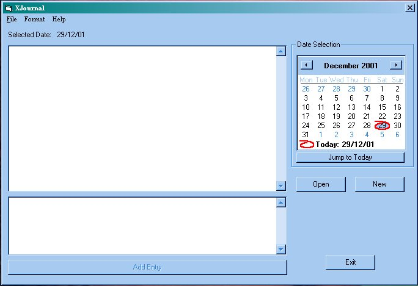



## A Simple Journal

### Description

This is one of my first Visual Basic creations. It's basically a little journal you can use for whatever purpouse you see fit (A personal diary, document the progress of your latest invention etc.). It stores entries in a database which can be viewed by selecting the date entered from the MonthView control on the right of the form.

Tell me what you think, how to improve and so on. I's far from finished but it works so far. Go easy though, i'm only a newbie!!!
 
### More Info
 

             |
---                |---
**Submitted On**   |2001-12-29 13:43:12
**By**             |[Dave Nicholson](https://github.com/Planet-Source-Code/PSCIndex/blob/master/ByAuthor/dave-nicholson.md)
**Level**          |Beginner
**User Rating**    |4.8 (57 globes from 12 users)
**Compatibility**  |VB 6\.0
**Category**       |[Complete Applications](https://github.com/Planet-Source-Code/PSCIndex/blob/master/ByCategory/complete-applications__1-27.md)
**World**          |[Visual Basic](https://github.com/Planet-Source-Code/PSCIndex/blob/master/ByWorld/visual-basic.md)
**Archive File**   |[A\_Simple\_J4456812292001\.zip](https://github.com/Planet-Source-Code/dave-nicholson-a-simple-journal__1-30199/archive/master.zip)

